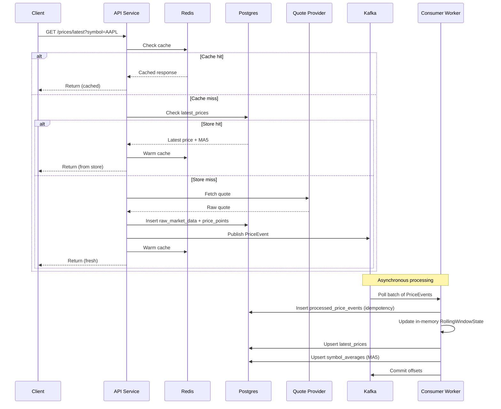
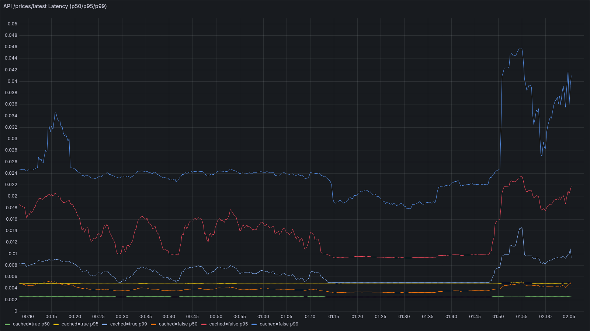
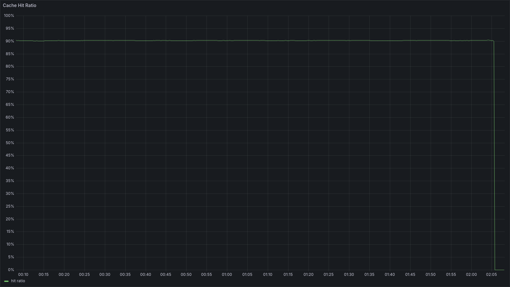
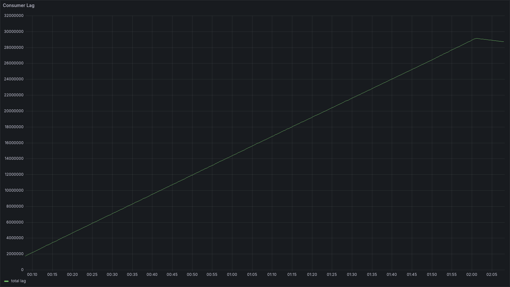
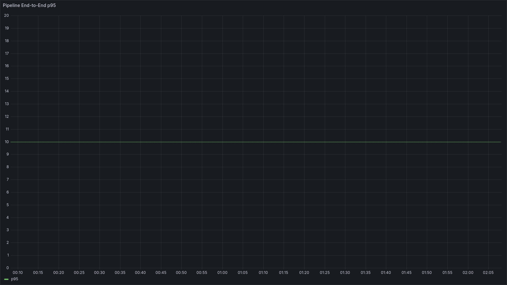
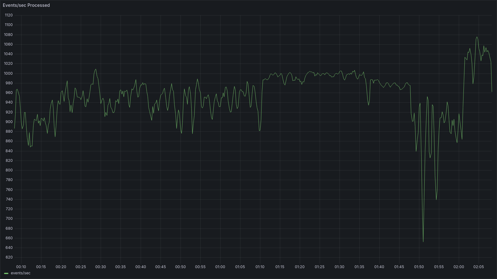

# Market Data Service

A real-time market data pipeline that fetches stock quotes, persists raw and normalized records, and computes rolling analytics asynchronously through Kafka. Built with FastAPI, Postgres, Kafka, Redis, and Prometheus.

---

## The Problem

This started as a take-home assignment from a company I was interviewing with. I dug into them a bit more and decided the company was too sketchy to continue with, so I never submitted it. But the prompt stuck with me. Months later I came back to it and realized the architecture it was asking for — a market data pipeline with async analytics, provider fallback, and caching — was a genuinely interesting problem worth building properly.

The core question is deceptively simple: *"What's the latest price for AAPL?"* But making that answer fast, reliable, and backed by real infrastructure is where it gets interesting. You need to store every raw provider response, normalize it into a clean schema, and compute derived analytics — all without slowing down the read path.

This is the same class of problem that platforms like Robinhood solve at scale. Their price feed ingests quotes from market data sources, persists every tick for compliance, publishes events through Kafka, and has workers pre-compute the derived data (daily change, sparklines, latest quotes) into dedicated read models. The user-facing API never scans raw history — it reads from those pre-materialized projections. The pattern has a name: **CQRS** (Command Query Responsibility Segregation). Writes go to an append-only event log. Reads come from denormalized projections that workers maintain asynchronously. The tradeoff is eventual consistency — the read model lags behind the write by however long the worker takes to process the event — but the payoff is that reads stay cheap and predictable regardless of how much data you've ingested.

The naive approach would be to skip all of that: fetch a quote, compute the moving average inline, and return everything in one request. That works until your provider rate-limits you, your average computation touches historical rows on every read, or your API latency spikes because you're doing too much in the request cycle.

So I broke the problem into two cooperating processes.

---

## The Architecture

The system is split into an **API service** and a **consumer worker**, both built from the same Docker image. The API handles user-facing reads and writes. The worker handles event-driven analytics in the background.



The reasoning behind this split: moving averages shouldn't be computed in the request handler. The API writes an event and returns a latest-price response immediately. The worker picks up that event later and updates the read models that future requests will use. The MA5 you see in a response might not include the quote from *that exact request* — and that's an intentional tradeoff for keeping the API fast.

---

## How the Read Path Works

The most important code path in the service is [`GET /prices/latest`](app/api/routes/prices.py). It follows a layered resolution strategy:

1. **Check Redis** — if there's a cached response under `latest:<provider>:<symbol>`, return it immediately
2. **Check the `latest_prices` table** — this is a dedicated O(1) read model, not a scan of the full history
3. **Fetch from the provider** — call Yahoo/Alpha Vantage/Finnhub, store the raw + normalized records, publish a Kafka event, warm the cache, return

The orchestration for all three of those branches lives in a single class: [`PriceIngestionService`](app/services/ingestion.py). Its `fetch_store_publish()` method is the one path used by both direct API calls and scheduled polling jobs. I didn't want two ingestion code paths diverging over time, so everything routes through the same place.

```python
# app/services/ingestion.py — the core orchestration method

def fetch_store_publish(self, symbol: str, provider: str | None = None) -> PriceLatestResponse:
    quote, provider_name = self._fetch_quote_with_fallback(symbol, requested_provider)

    with self._session_factory() as db:
        raw_row = RawMarketData(symbol=symbol, provider=provider_name, payload=quote.raw_payload, ...)
        db.add(raw_row)
        db.flush()

        price_point = PricePoint(symbol=symbol, provider=provider_name, price=quote.price, ...)
        db.add(price_point)
        db.flush()

        moving_average = db.execute(
            select(SymbolAverage.moving_average)
            .where(SymbolAverage.symbol == symbol, SymbolAverage.provider == provider_name, ...)
        ).scalar_one_or_none()

        db.commit()

    self._producer.send_event(event)       # publish to Kafka
    self._cache.set_latest(symbol, ...)    # warm Redis
    return response
```

This pattern means a cache miss can trigger fresh ingestion — the API is both a read path and a write trigger.

---

## Dealing with Rate Limits

External providers rate-limit aggressively. Yahoo in particular. I didn't want the service to just throw a 429 at users, so I built a few layers of defense.

**In-process rate limiting.** Every provider client gets its own [`MinuteRateLimiter`](app/services/rate_limiter.py) — a sliding-window limiter backed by a deque of timestamps. It blocks until a slot is available and reports how long it waited, which feeds into Prometheus metrics. It's not distributed (each process enforces its own budget), but it keeps a single process from burning through provider quotas.

**Provider fallback.** If Yahoo returns a rate-limit error and fallback is enabled, the service automatically tries Alpha Vantage. This happens transparently inside `_fetch_quote_with_fallback()` in the [ingestion service](app/services/ingestion.py). The cache is then warmed under *both* provider keys, so future reads hit regardless of which name is queried.

**Graceful degradation on rate limit.** If all providers fail and there's already a stored price in `latest_prices`, the API returns the stale data instead of a hard error. Only when there's truly nothing to return does it surface a 429 with a `Retry-After` header.

---

## The Consumer and O(1) Moving Averages

The [consumer worker](worker/consumer.py) polls Kafka in batches, validates each message against the `PriceEvent` Pydantic schema, and runs the batch through [`MovingAverageService`](app/services/moving_average.py).

The interesting part is how moving averages are computed. A naive implementation would query the last N price points from the database on every event. Instead, I maintain an in-memory [`RollingWindowState`](app/services/moving_average.py) per `(provider, symbol)` pair:

```python
@dataclass
class RollingWindowState:
    window_size: int
    prices: deque[Decimal]      # bounded deque, maxlen=window_size
    rolling_sum: Decimal = Decimal("0")

    def add_price(self, price: Decimal) -> tuple[int, Decimal | None]:
        if len(self.prices) == self.window_size:
            self.rolling_sum -= self.prices.popleft()

        self.prices.append(price)
        self.rolling_sum += price

        if len(self.prices) < self.window_size:
            return len(self.prices), None

        return len(self.prices), self.rolling_sum / Decimal(self.window_size)
```

Each update is O(1). When the window is full and a new price arrives, the oldest price gets subtracted from the rolling sum and popped from the front of the deque. No database queries, no recomputation.

The tradeoff is that this state lives in memory. If the consumer restarts, it loses the rolling windows and rebuilds from newly consumed events. That's acceptable for a window size of 5 — the average catches up quickly.

### Idempotent Processing

### Why Kafka Is In the Middle

It's worth stepping back and asking: why not just compute the moving average directly in the API handler? Or call the worker synchronously? You could build this without Kafka entirely.

**Without Kafka, the architecture looks like this:** the API fetches a quote, writes to Postgres, computes the moving average by querying the last N price points, updates `latest_prices`, and returns. Everything happens inline in the request. It's simpler, fewer moving parts.

But it breaks down in a few ways:

- **Latency coupling.** The user's response time now includes the moving average computation and two extra database writes. That's fine at low traffic, but under load every millisecond in the request path compounds.
- **Failure coupling.** If the average computation fails — maybe the DB is slow, maybe there's a deadlock on the upsert — the entire request fails. The user doesn't get their price even though the fetch succeeded.
- **No backpressure.** If you're ingesting faster than you can compute analytics (which my benchmark showed — 5,000 events/sec in vs ~900 processed), the API starts backing up. There's no buffer. Every request blocks until all downstream work is done.
- **No replay.** If the analytics logic has a bug and you need to reprocess historical events, you're out of luck. The events are gone after the request returned.

**Kafka solves all four of these:**

1. **Decoupling.** The API's job ends after writing to Postgres and publishing the event. It doesn't know or care whether the worker is running, behind, or even deployed. The response time is just fetch + store + publish.
2. **Durability.** Events survive in the topic even if the worker crashes. When it comes back, it picks up where it left off. Nothing is lost.
3. **Backpressure absorption.** When ingestion outpaces processing, Kafka absorbs the difference as lag. The API stays fast. The worker catches up at its own pace. My soak test showed exactly this: 29M events of lag accumulated, but the API's p50 stayed at ~5ms the entire time.
4. **Replayability.** If I ship a bug in the moving average logic, I can reset the consumer offset and reprocess from any point in time. The idempotency guard in the database prevents duplicate side effects.

That last point is where idempotency matters. Kafka provides **at-least-once delivery** — it guarantees every event is delivered, but the same event can arrive more than once (on consumer restarts, rebalances, or offset resets). So the worker needs to handle duplicates gracefully.

The approach is simple: before processing any event, the worker inserts into `processed_price_events` with `ON CONFLICT DO NOTHING`. If the insert returns nothing, the event was already processed and gets skipped.

```python
def _mark_processed(self, db: Session, event: PriceEvent) -> bool:
    stmt = (
        insert(ProcessedPriceEvent)
        .values(price_point_id=event.price_point_id, ...)
        .on_conflict_do_nothing(index_elements=[ProcessedPriceEvent.price_point_id])
        .returning(ProcessedPriceEvent.price_point_id)
    )
    inserted_id = db.execute(stmt).scalar_one_or_none()
    return inserted_id is not None
```

Kafka offsets are committed only after the database transaction succeeds, so a crash between processing and commit just means the batch gets retried — and the idempotency guard catches it. The combination of Kafka's at-least-once delivery with database-level deduplication gives the system **effectively-once processing semantics** without the complexity of Kafka's built-in exactly-once transactions.

---

## The Data Model

Six tables, each with a specific role:

| Table | Purpose |
|---|---|
| `raw_market_data` | Audit trail — the exact JSON payload and HTTP status from each provider call |
| `price_points` | Normalized price history with symbol/provider/timestamp, linked back to the raw record |
| `processed_price_events` | Idempotency guard — one row per processed event, keyed by `price_point_id` |
| `latest_prices` | The fast read model — one row per `(provider, symbol)` with the newest price + MA5 |
| `symbol_averages` | Rolling average per `(symbol, provider, window_size)` with sample size tracking |
| `polling_jobs` | Persistent polling job definitions with scheduling state |

The key insight is `latest_prices`. Normal reads never scan the full `price_points` table. The worker maintains this single-row-per-pair projection, so the API's read path is always a primary key lookup.

---

## Making Redis Optional

Redis is used as a short-TTL cache in front of `latest_prices`, but it's explicitly optional. The [`PriceCache`](app/services/cache.py) wrapper pings Redis at startup — if it's unreachable, caching silently disables itself instead of crashing the app:

```python
try:
    self._client = redis.Redis.from_url(settings.redis_url, decode_responses=True)
    self._client.ping()
except redis.RedisError:
    logger.warning("Redis not available at startup, cache disabled")
    self._client = None
    self.enabled = False
```

Every cache read and write checks `self.enabled` before touching Redis. If Redis fails mid-operation, the exception is caught and logged, not propagated. The service degrades to database-backed reads — slower, but correct.

---

## Observability

I instrumented everything. The Prometheus metrics in [`metrics.py`](app/services/metrics.py) cover:

- **HTTP latency** — generic per-route, plus a dedicated histogram for `/prices/latest` split by cache hit/miss
- **Provider performance** — call latency, error counts, rate-limiter waits per provider
- **Kafka pipeline** — events published, events consumed, consumer lag per partition
- **Database** — query and write durations
- **Cache** — hit/miss counters
- **End-to-end pipeline** — time from quote timestamp to `latest_prices` update

A pre-built [Grafana dashboard](grafana/provisioning/dashboards/market-performance.json) is auto-provisioned with five panels: API latency, cache hit ratio, consumer lag, pipeline p95, and events-per-second throughput.

---

## Running It

### Docker Compose (full stack)

```bash
cp .env.example .env
docker compose up --build
```

This brings up everything: API, consumer, Postgres, Kafka, Zookeeper, Redis, Prometheus, Grafana, and Adminer.

| Service | URL |
|---|---|
| API | `http://localhost:8000` |
| Adminer | `http://localhost:8080` |
| Prometheus | `http://localhost:9090` |
| Grafana | `http://localhost:3000` |

### Provider Configuration

Yahoo works out of the box. For Alpha Vantage or Finnhub, set API keys in `.env`:
- `ALPHA_VANTAGE_API_KEY`
- `FINNHUB_API_KEY`

Key tuning knobs:

| Category | Variables |
|---|---|
| Rate limiting | `PROVIDER_RATE_LIMIT_PER_MINUTE`, `PROVIDER_HTTP_MAX_RETRIES`, `PROVIDER_HTTP_BACKOFF_SECONDS` |
| Yahoo fallback | `ENABLE_YAHOO_RATE_LIMIT_FALLBACK`, `YAHOO_RATE_LIMIT_FALLBACK_PROVIDER` |
| Consumer tuning | `CONSUMER_BATCH_SIZE`, `CONSUMER_POLL_TIMEOUT_MS`, `CONSUMER_RETRY_BACKOFF_SECONDS` |
| Kafka | `KAFKA_TOPIC_PARTITIONS` |

### Local Development (no Docker)

```bash
python -m venv .venv
source .venv/bin/activate
pip install -r requirements.txt
cp .env.example .env
uvicorn app.main:app --reload
```

In a second terminal:

```bash
python -m worker.consumer
```

Requires local Postgres, Kafka, and Redis configured via `.env`.

---

## Example Calls

```bash
# Fetch latest price
curl "http://localhost:8000/prices/latest?symbol=AAPL&provider=yahoo"

# Create a polling job
curl -X POST "http://localhost:8000/prices/poll" \
  -H "Content-Type: application/json" \
  -d '{"symbols":["AAPL","MSFT"],"interval":60,"provider":"yahoo"}'

# Check job status
curl "http://localhost:8000/prices/poll/{job_id}"
```

---

## Testing and Smoke Test

Unit tests cover the deterministic core — the moving average helper and rolling window state:

```bash
pytest tests/
```

For end-to-end stack validation:

```bash
./scripts/smoke_test.sh
```

The smoke test verifies health, cache behavior, Postgres writes, Kafka event visibility, worker-side MA5 computation, polling job lifecycle, and negative-path validation.

---

## Benchmarking the Market Data Pipeline

How do you prove an architecture works? You break it. 

I wrote this benchmark suite to answer a specific question: *Where is the bottleneck?* If we bypass external provider rate limits and just hammer the service, what tips over first? Does the API slow down? Does the database lock up? Does the consumer fall behind?

### Bypassing the Providers for Synthetic Load

In the real world, Yahoo or Alpha Vantage will rate-limit you long before the infrastructure breaks. To truly test the system's capacity, I wrote a synthetic load generator (`scripts/load_generate.py`) that writes directly to the Kafka `price-events` topic, simulating the exact payload the API would normally publish.

This lets me pump thousands of simulated events per second into the consumer and database, completely isolating the downstream analytics pipeline from upstream API fetch limits. At the same time, I run an HTTP read-load generator (`scripts/read_load.py`) against `/prices/latest` using a 90/10 hot/cold symbol split to simulate realistic repeated read behavior.

### The One-Command Soak Test

The easiest way to see the system under stress is the automated soak benchmark. It spins up the stack, seeds the cache, starts the write and read generators in parallel, and collects the results.

```bash
chmod +x scripts/run_soak_benchmark.sh scripts/read_load.py

# Run for 1 hour
./scripts/run_soak_benchmark.sh

# Or push it for 2 hours
DURATION_SECONDS=7200 ./scripts/run_soak_benchmark.sh
```

When it finishes, the script writes a neat markdown summary and JSON blob (along with the raw logs) to `benchmarks/soak_<timestamp>/`. 

### Running Elements Manually

If you want to poke at the system interactively, here is how to drive the load manually:

First, spin up the stack:
```bash
docker compose up -d --build
```

Then, throw synthetic write load at it:
```bash
# Simulates 5,000 events/sec across 1,000 symbols for 60 seconds
python scripts/load_generate.py \
  --bootstrap-servers localhost:29092 \
  --topic price-events \
  --provider bench \
  --symbols 1000 \
  --rate 5000 \
  --duration 60
```
This tells me exactly how the consumer and database handle a sudden firehose.

### What the Dashboards Tell Us

While the load is running, the truth is in Grafana. Open `http://localhost:3000` and pull up the **Market Service Performance** dashboard. 

Here is what I watch for:
- **API `/prices/latest` latency:** Are reads staying fast (< 50ms) even while the database is hammered with writes?
- **Consumer lag:** Is the `kafka_consumer_lag` line going parabolic? If the write load exceeds the consumer's batch processing rate, this line tells the story.
- **Pipeline end-to-end p95:** How long does it actually take for a price injected at the start to become a 5-point moving average in the read model?

In my last 2-hour soak test, I proved that the CQRS decoupling worked perfectly. The consumer topped out at ~900 events/sec processed and fell 29 million events behind under a 5,000 eps load. But the API read path remained entirely stable with a p50 of ~5ms.

**Profile:** 5,000 events/sec write load, 500 req/sec read load (50 threads, 90/10 hot/cold split)

| Metric | Result |
|---|---|
| Events sent | 35,999,999 |
| Read requests | 3,600,000 |
| Errors | 0 |
| Read p50 | ~5ms |
| Read p95 | ~50ms |
| Cache hit ratio | ~90% |
| Consumer throughput | ~893 events/sec |
| Consumer lag (end of run) | ~29.1M |







---

## What I'd Do Next

- **Horizontal consumer scaling** — the Kafka topic already supports multiple partitions; adding consumer instances is the obvious throughput lever
- **Async DB driver** — the API uses synchronous SQLAlchemy; switching to asyncpg would improve concurrency under load
- **Distributed rate limiting** — the current per-process limiter doesn't coordinate across replicas
- **Backfill on consumer restart** — the in-memory rolling window resets on restart; seeding from recent `price_points` would avoid the warm-up period
